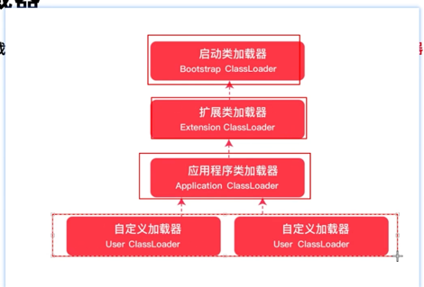

# Class Loader

## bootstrap classloader
- load java_home\lib
## extension classLoader
- java_home\lib\ext
## application classLoader
- user classpath
## user classLoader
- non application classloader
- example: JRebel

