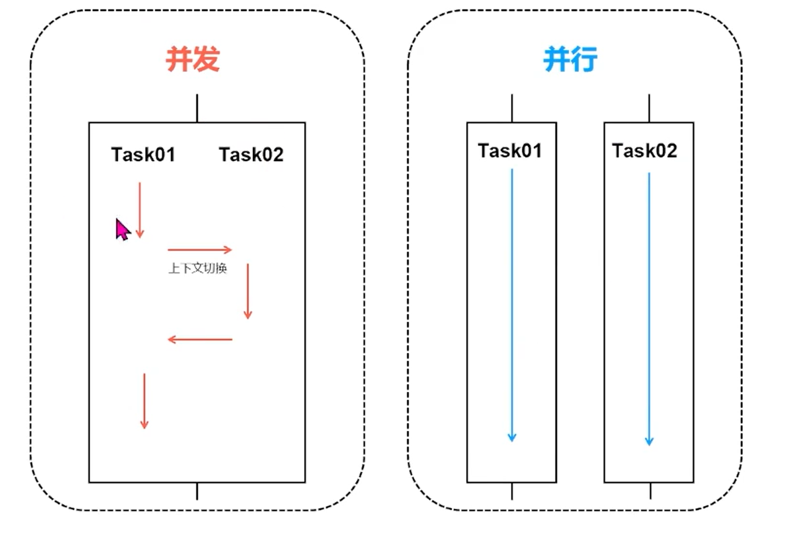
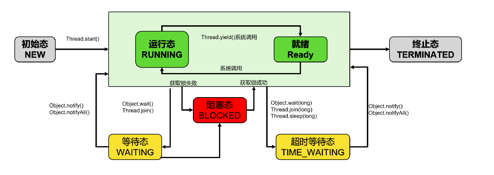
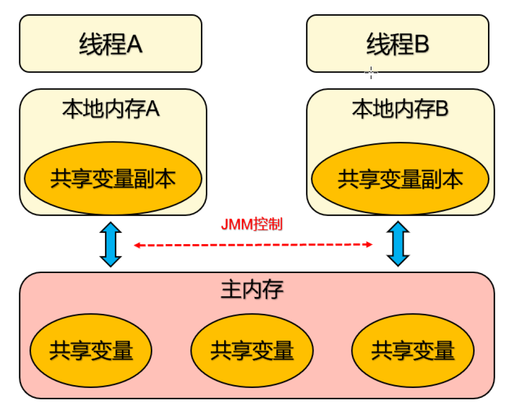
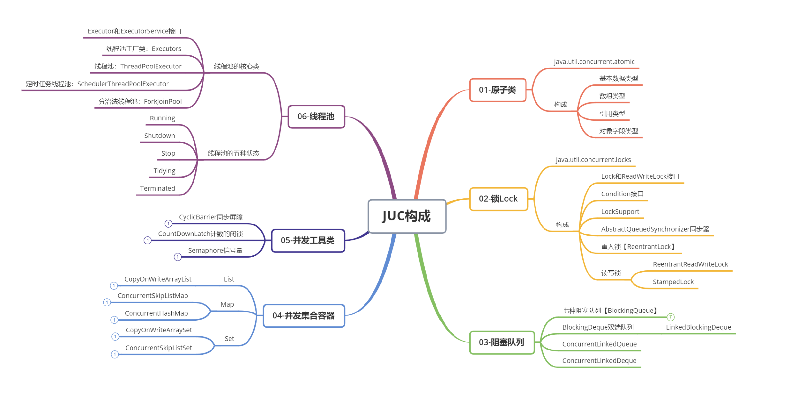

# 多线程相关概念
## 什么是并发与并行？
并发（Concurrent）：同一时间段，多个任务都在执行 ，单位时间内不⼀定同时执行。

并行（Parallel）：单位时间内，多个任务同时执行，单位时间内一定是同时执行。并行上限取决
于CPU核数（CPU时间片内50ms）

注意：并发是一种能力，而并行是一种手段。当我们的系统拥有了并发的能力后，代码如果跑在多核
CPU上就可以并行运行。所以咱们会说高并发处理，而不会说高并行处理。并行处理是基于硬件CPU的
是固定的，而并发处理的能力是可以通过设计编码进行提高的。

## 线程上下文切换会有什么问题
过多的线程并行执行会导致CPU资源的争抢，产生频繁的上下文切换，常常表现为高并发执行时，RT延
长。因此，合理控制上下文切换次数，可以提高多线程应用的运行效率。（也就是说线程并不是越多越
好，要合理的控制线程的数量。）

- 直接消耗：指的是CPU寄存器需要保存和加载，系统调度器的代码需要执行
- 间接消耗：指的是多核的cache之间得共享数据，间接消耗对于程序的影响要看线程工作区操作数
据的大小

## 线程状态：一个线程的一生
- NEW(新建) ：线程刚被创建，但是并未启动
- RUNNABLE(可运行)：线程可以在Java虚拟机中运行的状态，可能正在运行自己代码，也可能没
有，这取决于操作系统处理器
- BLOCKED(锁阻塞)：当一个线程试图获取一个对象锁，而该对象锁被其他的线程持有，则该线程
进入Blocked状态；当该线程持有锁时，该线程将变成Runnable状态
- WAITING(无限等待)：一个线程在等待另一个线程执行一个（唤醒）动作时，该线程进入Waiting
状态。进入这个状态后是不能自动唤醒的，必须等待另一个线程调用notify或者notifyAll方法才能
够唤醒
- TIMED_WAITING(计时等待)：同waiting状态，有几个方法有超时参数，调用他们将进入Timed
Waiting状态。这一状态将一直保持到超时期满或者接收到唤醒通知。带有超时参数的常用方法有
Thread.sleep 、Object.wait
- TERMINATED(被终止)：因为run方法正常退出而死亡，或者因为没有捕获的异常终止了run方法
而死亡

  
wait()与sleep()区别：
- 主要区别：sleep()方法没有释放锁，而wait()方法释放了锁
- wait()通常用于线程间的交互/通信，sleep()通常用于暂停线程执行
- wait()方法被调用后，线程不会自动苏醒，需要别的线程调用同一个对象的notify或notifyAll。
- sleep()方法执行完成后，线程会自动苏醒。或者可以使用wait(long)超时后，线程也会自动苏醒

# 线程安全问题
## 什么是线程安全
如果有多个线程在同时执行，而多个线程可能会同时运行一行代码。如果程序每次运行结果和单线程运
行的结果一样，且其他的变量的值也和预期一样，就是线程安全的，反之则是线程不安全的。

## 怎么解决这个问题呢
- 线程同步
- volatile
- JUC
  - 原子类（CAS）
  - 锁（AQS）

# 多线程并发的3个特性
并发编程中，三个非常重要的特性：原子性，有序性和可见性
1. 原子性(Atomicity)：即一个操作或多个操作，要么全部执行，要么就都不执。执行过程中，不能被打断
2. 有序性(Ordering)：程序代码按照先后顺序执行
   为什么会出现无序问题呢？因为指令重排 (Instruction reordering)
3. 可见性(Visibility)：当多个线程访问同一个变量时，一个线程修改了这个变量的值，其他线程能够立即看得到
   修改的值
   为什么出现不可见性问题呢？可以说是因为Java内存模型【JMM】

# 可见性
## 可见性案例：Java内存模型（JMM）
JMM线程操作内存的基本规则：

第一条，关于线程与主内存：线程对共享变量的所有操作都必须在自己的本地内存中进行，不能直
接从主内存中读写

第二条，关于线程间本地内存：不同线程之间无法直接访问其他线程本地内存中的变量，线程间变
量值的传递需要经过主内存

## 什么是内存可见性
可见性是一个线程对共享变量值的修改，能够及时的被其他线程看到。
线程 A 与线程 B 之间如要通信的话，必须要经历下面 2 个步骤：
1. 首先，线程 A 把本地内存 A 中更新过的共享变量刷新到主内存中去。
2. 然后，线程 B 到主内存中去读取线程 A 之前已更新过的共享变量。

## happens-before规则
- 程序顺序规则：一个线程中的每个操作，happens-before于该线程中的任意后续操作。
- 锁规则：对一个锁的解锁，happens-before于随后对这个锁的加锁。
- volatile变量规则：对一个volatile域的写，happens-before于任意后续对这个volatile域的读。
- 传递性：如果A happens-before B，且B happens-before C，那么A happens-before C。

## 同步原理剖析
synchronized是如何实现同步的呢？
同步操作主要是monitorenter和monitorexit这两个jvm指令实现的

## 什么是Monitor
Monitor中文翻译为管程，也有人称之为“监视器”，管程指的是管理共享变量以及对共享变量的操
作过程，让他们支持并发。

Java中的所有对象都可以作为锁，每个对象都与一个 monitor 相关联，线程可以对 monitor 执行
lock 和 unlock 操作

## 什么是锁优化？
如果只有一个线程运行时并没有发生资源竞争、或两个线程交替执行，使用传统锁机制无疑效率是
会比较低的。

JDK1.6中为了减少这两个场景，获得锁和释放锁带来的性能消耗，同步锁进行优化引入：偏向锁和
轻量级锁。

同步锁一共有四种状态，级别从低到高依次是：无锁，偏向锁，轻量级锁，重量级锁。这四种状态
会随着竞争激烈情况逐渐升级。

偏向锁
偏向锁则是基这样一个想法：只有一个线程访问锁资源（无竞争）的话，偏向锁就会把整个同步措施都
消除，并记录当前持有锁资源的线程和锁的类型。

轻量级锁
轻量级锁是基于这样一个想法：只有两个线程交替运行时，如果线程竞争锁失败了，先不立即挂起，而
是让它飞一会儿（自旋）spin lock，在等待过程中，可能锁就被释放了，这时该线程就可以重新尝试获取锁，同
时记录持有锁资源的线程和锁的类型。

## volatile
Java允许线程访问共享变量，为了确保共享变量能被准确和一致地更新，线
程应该确保通过排他锁单独获得这个变量。

volatile可以保证多线程场景下变量的可见性和有序性。如果某变量用volatile修饰，则可以确
保所有线程看到变量的值是一致的。

volatile will synchronize the thread local memory to the public memory to make sure the visiblity

## volatile缺陷：原子性Bug

volatile适合使用场景

变量真正独立于其他变量和自己以前的值，在单独使用的时候，适合用volatile

对变量的写入操作不依赖其当前值：例如++和--运算符的场景则不行
该变量没有包含在具有其他变量的不变式中

synchronized和volatile比较
volatile不需要加锁，比synchronized更轻便，不会阻塞线程
synchronized既能保证可见性，又能保证原子性，而volatile只能保证可见性，无法保证原子性
与synchronized相比volatile是一种非常简单的同步机制

# 并发编程
## JUC (java.util.concurrent)

## Lock and AQS

JUC包中提供的锁：

ReentrantLock重入锁，它是一种可重入的独享锁，具有与使用 synchronized 相同的一些基本行
为和语义，但是它的API功能更强大，ReentrantLock 相当于synchronized 的增强版，具有
synchronized很多所没有的功能。

ReentrantReadWriteLock读写锁
synchronized和ReentrantLock都是同步互斥锁，不管是读操作的线程还是写操作的线程，同
时只能有一个线程获得锁，也就是在进行写操作的时候，在写线程进行访问的时候，所有的线
程都会被阻塞。但是其实，读操作是不需要加锁访问的。互斥锁不区分读写，全部加锁实现起
来简单，但是性能会大打折扣。

ReentrantReadWriteLock维护了一对关联锁：ReadLock和WriteLock，由词知意，一个读锁
一个写锁，合称“读写锁”。一个是ReadLock(读锁)用于读操作的，一个是WriteLock(写锁)用于
写操作，这两个锁都实现了Lock接口。读写锁适合于读多写少的场景，基本原则是读锁可以
被多个线程同时持有进行访问，而写锁只能被一个线程持有。
StampedLock重入读写锁，JDK1.8引入的锁类型，是对读写锁ReentrantReadWriteLock的增强
版

## 线程协作工具类

### CountDownLatch倒数门闩

倒数结束之前，一直处于等待状态，直到数到0结束，此线程才继续工作。
场景：购物拼团，大巴人满发车，分布式锁

主要方法：
- 构造函数：CountDownLatch(int count)：只有一个构造函数，参数count为需要倒数的数值。
- await()：当一个或多个线程调用await()时，这些线程会阻塞。
- countDown()：其他线程调用countDown()会将计数器减1，调用countDown方法的线程不会阻
塞。当计数器的值变为0时，因await方法阻塞的线程会被唤醒，继续执行

### Semaphore信号量

用来限制或管理数量有限资源的使用情况。

主要方法：
- 构造函数：Semaphore(int permits,Boolean fair)：可以设置是否使用公平策略，如果传入true,则
- Semaphore会把之前等待的线程放到FIFO队列里，以便有了新许可证可以分给之前等待时间最长
的线程。
- acquire()：获取许可证，当一个线程调用acquire操作时，他要么通过成功获取信号量（信号量减
1），要么一直等待下去，直到有线程释放信号量，或超时。
- release()：释放许可证，会将信号量加1，然后唤醒等待的线程。

### CyclicBarrier循环栅栏

主要方法：

- 构造函数：CyclicBarrier(int parties, Runnable barrierAction)，设置聚集的线程数量和集齐线程
数的结果之后要执行的动作。 
- await()：阻塞当前线程，待凑齐线程数量之后继续执行

线程会等待，直到线程到了事先规定的数目，然后触发执行条件进行下一步动作

当有大量线程互相配合，分别计算不同任务，并且需要最后统一汇总时，就可以用CyclicBarrier，它可 以构造一个集结点，当某一个线程执行完，它就会到集结点等待，直到所有线程都到集结点，则该栅栏 就被撤销，所有线程统一出再，继续执行剩下的任务。

### 并发容器

在JUC包中，有一大部分是关于并发容器的，如ConcurrentHashMap，ConcurrentSkipListMap， CopyOnWriteArrayList及阻塞队列。这里将介绍使用频率、面试中出现频繁的最高的 ConcurrentHashMap和阻塞队列。

#### JDK 早期线程安全的集合 (用lock保证线程安全)
- vector
- stack
- hashtable

### 线程池
